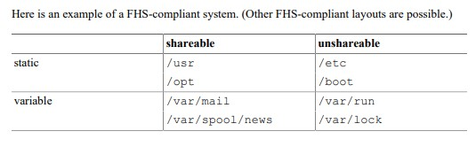

# LFCS Study Notes - LFS207

## Table of Contents
- [Chapter 2: Linux Filesystem Tree Layout](#chapter-2-linux-filesystem-tree-layout)
- [Chapter 3: User Environment](#chapter-3-user-environment)
- [Chapter 4: User Account Management](#chapter-4-user-account-management)
- [Chapter 5: Group Management](#chapter-5-group-management)
- [Chapter 6: File Permissions and Ownership](#chapter-6-file-permissions-and-ownership)
- [Chapter 7-9: Package Management (dpkg/APT)](#chapter-7-9-package-management-dpkgapt)
- [Chapter 13: Git Fundamentals](#chapter-13-git-fundamentals)
- [Chapter 14: Processes](#chapter-14-processes)
- [Chapter 15: Process Monitoring](#chapter-15-process-monitoring)

---

## Chapter 2: Linux Filesystem Tree Layout

### Data Distinctions
- **Shareable data**: Can be shared between hosts (e.g., home directories, /var/mail)
- **Non-shareable data**: Specific to individual host (e.g., lock files, /etc, /boot)
- **Variable data**: Changes frequently (e.g., log files, spool directories, temporary files)
- **Static data**: Doesn't change without admin intervention (e.g., binaries, libraries, documentation)

### Key Reference
- [Filesystem Hierarchy Standard (FHS)](https://refspecs.linuxfoundation.org/FHS_3.0/fhs-3.0.pdf) - defines directory structure requirements


### The Root (/) Directory
- Must contain all essential files to boot and mount other filesystems
- **FHS Rule**: No applications should create new subdirectories directly under /
- Should be small and contain only essential system files

### /bin
- Essential command binaries for all users
- **Required programs**: cat, chgrp, chmod, chown, cp, date, dd, df, dmesg, echo, false, hostname, kill, ln, login, ls, mkdir, mknod, more, mount, mv, ps, pwd, rm, rmdir, sed, sh, stty, su, sync, true, umount, uname
- **Modern systems**: Often symlinked to /usr/bin (check with `ls -la /bin`)
- Must be available in single-user mode

### /boot
- Everything required for boot process before kernel executes user-mode programs
- **Essential files**:
  - **vmlinuz**: Compressed Linux kernel
  - **initramfs** (or initrd): Initial RAM filesystem
  - **grub/**: GRUB bootloader configuration directory
- **Debugging/Optional files**:
  - **config-[kernel-version]**: Kernel compilation configuration
  - **System.map-[kernel-version]**: Kernel symbol table for debugging
- **Important**: Keep /boot small (200-500MB typically sufficient)

### /dev
- Device nodes (character and block devices)
- Populated by udev dynamically
- **Key devices**:
  - `/dev/null`: Discards all data written to it
  - `/dev/zero`: Provides null bytes
  - `/dev/random` & `/dev/urandom`: Random number generators
  - `/dev/sda`, `/dev/sdb`: SCSI/SATA drives
  - `/dev/tty*`: Terminal devices
- ![][image2] *(image placeholder)*

### /etc
- System-wide configuration files (editable text configs)
- **Important subdirectories/files**:
  - `/etc/skel/`: Template files for new user home directories
  - `/etc/systemd/`: Systemd service configurations
  - `/etc/init.d/`: SysV init scripts (legacy)
  - `/etc/fstab`: Filesystem mount configuration
  - `/etc/hosts`: Static hostname lookups
  - `/etc/passwd`, `/etc/group`, `/etc/shadow`: User/group databases
  - `/etc/apt/`: APT package manager configuration
  - `/etc/ssh/`: SSH server/client configuration
  - `/etc/cron.*`: Scheduled task directories

### /lib and /lib64
- Essential shared libraries for /bin and /sbin binaries
- **Contains**:
  - Kernel modules: `/lib/modules/[kernel-version]/`
  - PAM modules: `/lib/security/` or `/lib/x86_64-linux-gnu/security/`
- **64-bit systems**: /lib64 for 64-bit libraries, /lib for 32-bit
- Often symlinked in modern distributions

### /media
- Mount points for removable media (automatic mounting)
- Managed by desktop environments/systemd
- Typical mounts: `/media/[username]/[device-label]`

### /mnt
- Temporary mount point for manual filesystem mounting
- Network shares often mounted here: NFS, SMB/CIFS, etc.
- Convention: Create subdirectories for different mount types

### /opt
- Optional/third-party software packages
- Self-contained applications (all files in one directory)
- Common usage: `/opt/[vendor]/[package]/`

### /proc
- Virtual filesystem (procfs) - exists only in memory
- Process and kernel information
- **Key files**:
  - `/proc/[PID]/`: Directory for each running process
  - `/proc/cpuinfo`: CPU information
  - `/proc/meminfo`: Memory usage statistics
  - `/proc/interrupts`: Interrupt usage
  - `/proc/mounts`: Currently mounted filesystems
  - `/proc/partitions`: Available partitions
  - `/proc/sys/`: Kernel tunable parameters

### /sys
- Virtual filesystem (sysfs) for device and kernel information
- Hardware device hierarchy
- Used by udev for device management
- Power management, module parameters

### /run
- Runtime variable data (cleared on reboot)
- Replaces older /var/run and /var/lock
- PID files, sockets, temporary system state

### Additional Important Directories
- **/home**: User home directories
- **/root**: Root user's home directory
- **/srv**: Data for services (web, ftp, etc.)
- **/tmp**: Temporary files (often cleared on reboot)
- **/usr**: Secondary hierarchy (user programs and data)
- **/var**: Variable data (logs, spool, cache)

### Disk Commands
- **Check disk usage**: `sudo du --max-depth=1 -hx /`
  - `-x`: Stay on one filesystem (ignore /dev /proc /run /sys)
  - `-h`: Human-readable sizes
  - `--max-depth=1`: Only show one level deep

- **Additional disk utilities**:
  - `df -h`: Show filesystem disk space usage
  - `df -i`: Show inode usage
  - `lsblk`: List block devices in tree format
  - `blkid`: Show block device attributes (UUID, TYPE)
  - `fdisk -l`: List disk partitions
  - `parted -l`: List partitions (supports GPT)
  - `mount`: Show mounted filesystems
  - `findmnt`: Tree view of mounted filesystems

- **Process information from /proc**:
  - `cat /proc/[PID]/cmdline`: Command line
  - `cat /proc/[PID]/cwd`: Current working directory (symbolic link)
  - `cat /proc/[PID]/environ`: Environment variables
  - `cat /proc/[PID]/status`: Process status and statistics

---

## Chapter 3: User Environment

### Environment Variables
- **Important Variables**:
  - **HOME**: User's home directory
  - **PATH**: Ordered list of directories to search for executables
  - **PS1**: Primary prompt string
  - **PS2**: Secondary prompt (continuation)
  - **SHELL**: User's login shell (e.g., /bin/bash)
  - **EDITOR**: Default text editor
  - **USER**: Current username
  - **PWD**: Current working directory
  - **OLDPWD**: Previous working directory
  - **LANG**: System language/locale

- **Setting Variables**:
  - **Temporary**: `VARIABLE=value` or `export VARIABLE=value`
  - **Persistent (user)**: Edit `~/.bashrc` and use `source ~/.bashrc` before using
  - **Persistent (system)**: Add to `/etc/environment` or `/etc/profile.d/`

- **Viewing Variables**:
  - `env`: Show all environment variables
  - `set`: Show all variables (including shell variables)
  - `echo $VARIABLE`: Show specific variable
  - `printenv VARIABLE`: Alternative to echo

### $ history
The shell stores history in `~/.bash_history`:
- **Location of the history file**: `$HISTFILE`
- **Maximum number of lines in the history file**: `$HISTFILESIZE` (default: 2000)
- **Maximum number of lines in current session**: `$HISTSIZE` (default: 1000)
- **Control what's saved**: `$HISTCONTROL` (ignoredups, ignorespace, ignoreboth)
- **Patterns to exclude**: `$HISTIGNORE`

### Previous Commands Using History
All history substitutions start with `!`:
- **!!**: Repeat last command
- **!$**: Last argument of previous command
- **!^**: First argument of previous command
- **!***: All arguments of previous command
- **!n**: Execute command number n
- **!-n**: Execute n commands ago
- **!string**: Most recent command starting with string
- **!?string?**: Most recent command containing string
- **^old^new**: Replace old with new in previous command

**Keyboard shortcuts**:
- **Ctrl+R**: Reverse search through history
- **Ctrl+S**: Forward search (if enabled)
- **Ctrl+P**: Previous command (same as up arrow)
- **Ctrl+N**: Next command (same as down arrow)

### Command Aliases
- **Create alias**: `alias name='command'`
- **Remove alias**: `unalias name`
- **List aliases**: `alias` (no arguments)
- **Make persistent**: Add to `~/.bashrc` or `~/.bash_aliases`

**Useful examples**:
```bash
alias ll='ls -alF'
alias la='ls -A'
alias l='ls -CF'
alias ..='cd ..'
alias ...='cd ../..'
alias grep='grep --color=auto'
alias update='sudo apt update && sudo apt upgrade'
```

### Determine the Current User
- **who**: Shows all logged-in users
  - `who -b`: Last system boot time
  - `who -r`: Current runlevel
- **whoami**: Shows effective username
- **id**: Shows user and group IDs
  - `id -u`: User ID only
  - `id -g`: Group ID only
  - `id -G`: All group IDs
  - `id -n`: Show names instead of numbers
- **w**: Show who's logged in and what they're doing
- **last**: Show login history
- **lastlog**: Show last login for all users

### Startup Files
**Login Shell Order**:
1. `/etc/profile`: System-wide profile (always read first)
2. `~/.bash_profile`: User's personal profile
3. `~/.bash_login`: Alternative if .bash_profile doesn't exist
4. `~/.profile`: Used if neither above exist

**Non-Login Shell**:
- `~/.bashrc`: Executed for interactive non-login shells
- `/etc/bash.bashrc`: System-wide bashrc (Debian/Ubuntu)

**Logout**:
- `~/.bash_logout`: Executed on logout

**Important Notes**:
- Login shells: SSH, console login, `su -`
- Non-login shells: Terminal emulators, `su`, `bash`
- Best practice: Source .bashrc from .bash_profile

---

## Chapter 4: User Account Management

### User Files
- **/etc/passwd**: User account information (world-readable)
- **/etc/shadow**: Encrypted passwords (root-only)
- **/etc/login.defs**: Login definitions (UID_MIN, PASS_MAX_DAYS, etc.)
- **System users < 1000, normal users ≥ 1000** (or as defined in UID_MIN)

**Note**: It is bad practice to edit /etc/passwd, /etc/group or /etc/shadow directly; use appropriate utilities such as usermod, or for advanced users - the slightly safer tools vipw/vigr.

### User Commands
- **useradd**: Create new user
  - `sudo useradd -m -s /bin/bash john` # Create with home directory
  - `sudo useradd -g developers -G sudo,docker john` # Primary + secondary groups
  - `sudo useradd -d /home/johnny -c "John Doe" john` # Custom home and comment
  - `sudo useradd -e 2024-12-31 john` # Account expiration
  - `sudo useradd -r systemuser` # System user (UID < 1000)

- **usermod**: Modify user
  - `sudo usermod -L john` # Lock account
  - `sudo usermod -U john` # Unlock account
  - `sudo usermod -aG docker john` # Add to group (keep existing)
  - `sudo usermod -g newprimary john` # Change primary group
  - `sudo usermod -s /bin/zsh john` # Change shell
  - `sudo usermod -d /home/newjohn -m john` # Move home directory

- **userdel**: Delete user
  - `sudo userdel john` # Delete user (keep home)
  - `sudo userdel -r john` # Delete user and home directory
  - `sudo userdel -f john` # Force deletion (even if logged in)

### Password Management
- **passwd**: Change passwords
  - `passwd` # Change own password
  - `sudo passwd john` # Change another user's password
  - `sudo passwd -l john` # Lock password
  - `sudo passwd -u john` # Unlock password
  - `sudo passwd -d john` # Delete password (dangerous!)
  - `sudo passwd -e john` # Expire password immediately
  - `sudo passwd -S john` # Show password status

- **chage**: Password aging (force password change, set expiration)
  - `sudo chage -l john` # List password aging info
  - `sudo chage -d 0 john` # Force password change on next login
  - `sudo chage -m 14 -M 30 john` # Min 14 days, max 30 days between changes
  - `sudo chage -E 2012-4-1 john` # Set account expiration
  - `sudo chage -I 30 john` # Disable after 30 days inactive
  - `sudo chage -W 7 john` # Warn 7 days before expiration

### Additional User Management
- **getent**: Query user databases
  - `getent passwd john` # Get user info
  - `getent group docker` # Get group info
- **vipw/vigr**: Safely edit passwd/group files
- **pwck/grpck**: Check passwd/group file integrity

---

## Chapter 5: Group Management

### Group Files
- **/etc/group**: Group definitions
- **/etc/gshadow**: Group passwords (rarely used)

### Group Commands
- **groupadd**: Create group
  - `sudo groupadd developers`
  - `sudo groupadd -g 1500 developers` # Specific GID
  - `sudo groupadd -r systemgroup` # System group

- **groupmod**: Modify group
  - `sudo groupmod -n newname oldname` # Rename
  - `sudo groupmod -g 1501 developers` # Change GID

- **groupdel**: Delete group
  - `sudo groupdel developers`

- **gpasswd**: Manage groups
  - `sudo gpasswd -a john developers` # Add user to group
  - `sudo gpasswd -d john developers` # Remove user from group
  - `sudo gpasswd -A john developers` # Make john group admin

### Viewing Groups
- **groups**: Show groups for user
- **id -Gn**: Show all group names
- **getent group**: List all groups

---

## Chapter 6: File Permissions and Ownership

### Permission Structure
- **Format**: `rwxrwxrwx` (user, group, other)
- **u** stands for user (owner)
- **g** stands for group
- **o** stands for other (world)

### Permission Values
- **r** (read): 4
- **w** (write): 2  
- **x** (execute): 1
- **Octal representation**: Sum of values (e.g., 7 = read/write/execute, 6 = read/write, 5 = read/execute)

### chmod - Change Permissions
- **Symbolic mode**:
  - Permissions can be added using `+` and revoked using `-`
  - `chmod u+x file` # Add execute for user
  - `chmod g-w file` # Remove write for group
  - `chmod o=r file` # Set other to read-only
  - `chmod a+x file` # Add execute for all
  - `chmod u=rwx,g=rx,o=r file` # Set specific

- **Octal mode**:
  - `chmod 755 file` # rwxr-xr-x
  - `chmod 644 file` # rw-r--r--
  - `chmod 700 file` # rwx------
  - `chmod 666 file` # rw-rw-rw-

### Special Permissions
- **SUID (4)**: `chmod u+s file` or `chmod 4755 file`
- **SGID (2)**: `chmod g+s dir` or `chmod 2755 dir`
- **Sticky bit (1)**: `chmod +t dir` or `chmod 1777 dir`

### Ownership
- **chown**: Change ownership
  - `sudo chown wally file`
  - `sudo chown wally:cleavers file` # Change both user and group
  - `sudo chown -R wally:cleavers directory/`
  - `sudo chown :cleavers file` # Group only

- **chgrp**: Change group
  - `sudo chgrp cleavers file`
  - `sudo chgrp -R cleavers directory/`

### umask
- Sets default permissions for new files/directories
- **View current**: `umask`
- **Set umask**: `umask 022` # Results in 755 for dirs, 644 for files
- **Calculation**: Default permissions (777 for dirs, 666 for files) - umask = final permissions
- **Persistent**: Add to ~/.bashrc or /etc/profile

### Access Control Lists (ACL)
- **View ACL**: `getfacl file`
- **Set ACL**: 
  - `setfacl -m u:fool:rw /tmp/afile` # User ACL
  - `setfacl -m g:developers:rx file` # Group ACL
  - `setfacl -m d:u:john:rwx directory/` # Default ACL
  - `setfacl -x u:john file` # Remove specific ACL
  - `setfacl -b file` # Remove all ACLs
- **Copy ACL**: `getfacl file1 | setfacl --set-file=- file2`

---

## Chapter 7-9: Package Management (dpkg/APT)

### dpkg - Low Level Package Manager
- **Query installed packages**:
  - `dpkg -l` # List all packages
  - `dpkg -l | grep apache` # Search installed packages
  - `dpkg -s package` # Show package details (e.g., `dpkg -s dpkg | grep -i version`)
  - `dpkg -L package` # List files in package
  - `dpkg -S /path/to/file` # Find package owning file (e.g., `dpkg -S /etc/init/networking.conf`)
  - `dpkg --get-selections` # Show package selections

- **Package management**:
  - `sudo dpkg -i package.deb` # Install package
  - `sudo dpkg -r package` # Remove (keep config)
  - `sudo dpkg -P package` # Purge (remove everything including config)
  - `sudo dpkg --configure -a` # Fix interrupted installs

- **Verification**:
  - `sudo dpkg -V` # Verify all packages
  - `sudo dpkg -V package` # Verify specific package
  - `sudo dpkg -C` # Check for broken packages

### APT - Advanced Package Tool
- **Update and upgrade**:
  - `sudo apt update` # Update package lists
  - `sudo apt upgrade` # Upgrade packages
  - `sudo apt full-upgrade` # Upgrade with dependency changes
  - `sudo apt dist-upgrade` # Same as full-upgrade

- **Package installation**:
  - `sudo apt install package`
  - `sudo apt install package1 package2`
  - `sudo apt install package=version` # Specific version
  - `sudo apt install ./local-package.deb` # Local .deb file

- **Package removal**:
  - `sudo apt remove package` # Remove package
  - `sudo apt purge package` # Remove package and config
  - `sudo apt autoremove` # Remove unneeded dependencies (e.g., old kernels)
  - `sudo apt clean` # Clear package cache
  - `sudo apt autoclean` # Clear old package cache

### Package Queries
- **apt-cache** (cached package info):
  - `apt-cache search apache2` # Search packages
  - `apt-cache show apache2` # Show package details
  - `apt-cache showpkg apache2` # Show dependencies
  - `apt-cache depends apache2` # List dependencies
  - `apt-cache rdepends package` # Reverse dependencies
  - `apt-cache policy package` # Show versions/sources

- **apt-file** (search file contents):
  - `sudo apt-get install apt-file` # Install first
  - `sudo apt-file update` # Update file database
  - `apt-file search apache2.conf` # Find package with file
  - `apt-file list apache2` # List files in package

### Additional APT Commands
- **apt list**:
  - `apt list` # List all available packages
  - `apt list --installed` # List installed packages
  - `apt list --upgradable` # List upgradable packages
  - `apt list package` # Show if package is installed

- **apt show**: Show package details (like apt-cache show)
- **apt edit-sources**: Edit sources.list safely

### APT Configuration
- **/etc/apt/sources.list**: Main repository configuration
- **/etc/apt/sources.list.d/**: Additional repository files
- **/etc/apt/apt.conf.d/**: APT configuration snippets
- **/etc/apt/preferences.d/**: Package pinning

### Repository Management
- **add-apt-repository**:
  - `sudo add-apt-repository ppa:example/ppa`
  - `sudo add-apt-repository --remove ppa:example/ppa`
- **Software Properties**: `sudo software-properties-gtk`

---

## Chapter 13: Git Fundamentals

### Initial Configuration
- **Global settings**:
  ```bash
  git config --global user.name "Gladys West"
  git config --global user.email "gwest@example.com"
  git config --global init.defaultBranch main
  git config --global core.editor vim
  git config --global pull.rebase false  # merge (default)
  ```

- **View configuration**:
  - `git config --list` # All settings
  - `git config user.name` # Specific setting
  - `git config --global --edit` # Edit global config

### Basic Commands
- **Repository initialization**:
  - `git init` # Initialize new repo
  - `git clone URL` # Clone remote repo
  - `git clone . --no-hardlinks /tmp/meow/` # Full copy ensuring files are copied not linked

- **Basic workflow**:
  - `git status` # Check status
  - `git add file` # Stage file
  - `git add .` # Stage all changes
  - `git commit -m "message"` # Commit
  - `git commit -am "message"` # Add and commit

### Viewing History
- **Log commands**:
  - `git log` # Full history
  - `git log --oneline` # Compact view
  - `git log --graph` # Show branch graph
  - `git log -n 20` # Last 20 commits
  - `git log --pretty=oneline -n 20 --graph --abbrev-commit` # Custom format with short hash
  - `git log --since="2 weeks ago"` # Time-based
  - `git log --author="Name"` # By author
  - `git log -p` # Show patches
  - `git log --stat` # Show statistics

### Branching and Merging
- **Branch operations**:
  - `git branch` # List branches
  - `git branch newbranch` # Create branch
  - `git checkout branch` # Switch branch
  - `git checkout -b newbranch` # Create and switch
  - `git branch -d branch` # Delete branch
  - `git branch -D branch` # Force delete

- **Merging**:
  - `git merge branch` # Merge branch
  - `git merge --abort` # Abort merge

### Remote Operations
- **Managing remotes**:
  - `git remote -v` # List remotes
  - `git remote add origin URL` # Add remote
  - `git remote remove origin` # Remove remote

- **Syncing**:
  - `git fetch` # Download changes
  - `git pull` # Fetch and merge
  - `git push` # Upload changes
  - `git push -u origin main` # Set upstream

### Undoing Changes
- **Unstaged changes**:
  - `git checkout -- file` # Discard changes
  - `git restore file` # Newer syntax

- **Staged changes**:
  - `git reset HEAD file` # Unstage
  - `git restore --staged file` # Newer syntax

- **Commits**:
  - `git reset --soft HEAD~1` # Undo commit, keep changes
  - `git reset --hard HEAD~1` # Undo commit, discard changes
  - `git revert commit-hash` # Create reverse commit

### Stashing
- `git stash` # Save working directory
- `git stash list` # List stashes
- `git stash pop` # Apply and remove stash
- `git stash apply` # Apply but keep stash

### Tags
- `git tag` # List tags
- `git tag v1.0` # Create lightweight tag
- `git tag -a v1.0 -m "Version 1.0"` # Annotated tag
- `git push --tags` # Push tags

---

## Chapter 14: Processes

### Process Concepts
Every process has:
- **PID**: Process ID (unique identifier)
- **PPID**: Parent Process ID
- **PGID**: Process Group ID
- **SID**: Session ID

Process components include program code, data, variables, file descriptors, and an environment.

When a process is started, it is isolated in its own user space to protect it from other processes. Processes do not have direct access to hardware - they must use **system calls** to indirectly access hardware.

### Process Limits
- **ulimit**: Built-in bash command for process resource limits
- **View limits**: `ulimit -a`
- **Common limits**:
  - `ulimit -n` # Open files (soft limit)
  - `ulimit -Hn` # Open files (hard limit)
  - `ulimit -u` # Max user processes
  - `ulimit -s` # Stack size
  - `ulimit -c` # Core file size

- **Configuration**:
  - `/etc/security/limits.conf` # Persistent limits
  - `/proc/sys/kernel/pid_max` # Max concurrent processes

- **Hard vs Soft limits**:
  - **Hard**: Maximum value (set only by root) - `ulimit -H -n`
  - **Soft**: Current limit (user modifiable up to hard limit) - `ulimit -S -n`

### Process Viewing
- **ps command**:
  - `ps` # Current shell processes
  - `ps aux` # All processes (BSD style)
  - `ps -ef` # All processes (System V)
  - `ps -ejH` # Process tree
  - `ps -u username` # By user
  - `ps -C processname` # By command

- **top/htop**:
  - Interactive process viewer
  - Key commands in top:
    - `k`: Kill process
    - `r`: Renice
    - `f`: Select fields
    - `q`: Quit

- **Other tools**:
  - `pstree` # Process tree view
  - `pgrep name` # Find process IDs
  - `pidof name` # Get PID of process

### Job Control
- **Background/Foreground**:
  - `command &` # Run in background
  - `Ctrl+Z` # Suspend current process
  - `bg` # Resume in background
  - `fg` # Bring to foreground
  - `jobs` # List jobs (shows job IDs with + and - indicators)
  - `bg %1` # Background job 1
  - `fg %2` # Foreground job 2
  - `disown %1` # Detach job from shell

Example output:
```
$ jobs
[1]-  Running    updatedb &
[2]+  Stopped    sleep 10
```

### Process Priority
- **Nice values**: Range from -20 (lowest nice, highest priority) to +19 (highest nice, lowest priority)
- **Commands**:
  - `nice -n 10 myprog` # Start with nice value 10
  - `renice +5 -p 20003` # Change priority of PID 20003
  - `renice +5 -u username` # Change user's processes

### Scheduling Tasks
- **at command** (one-time execution):
  - `at now + 2 days` # Schedule for 2 days from now
  - `at now + 2 hours` # Schedule for 2 hours
  - `at 10:30 PM` # Specific time
  - `at tomorrow` # Tomorrow same time
  - `atq` # List queued jobs
  - `atrm job#` # Remove job

- **cron** (recurring tasks):
  - `crontab -e` # Edit user crontab
  - `crontab -l` # List crontab
  - `crontab -r` # Remove crontab
  - `crontab -u username -l` # View user's crontab
  
- **Crontab format**:
  ```
  # m h dom mon dow command
  # * * * * * command
  # │ │ │ │ │
  # │ │ │ │ └─── day of week (0-7, Sun=0 or 7)
  # │ │ │ └───── month (1-12)
  # │ │ └─────── day of month (1-31)
  # │ └───────── hour (0-23)
  # └─────────── minute (0-59)
  ```

- **Cron examples**:
  - `0 2 * * * /script.sh` # Daily at 2 AM
  - `*/15 * * * * /script.sh` # Every 15 minutes
  - `0 */4 * * * /script.sh` # Every 4 hours
  - `0 9-17 * * 1-5 /script.sh` # Hourly, Mon-Fri, 9AM-5PM
  - `@reboot /script.sh` # On system boot
  - `@daily /script.sh` # Once a day

- **System cron**:
  - `/etc/crontab` # System-wide crontab
  - `/etc/cron.d/` # Drop-in cron files
  - `/etc/cron.{hourly,daily,weekly,monthly}/` # Script directories

### Process Control
- **Signals**:
  - `kill PID` # Send SIGTERM (15)
  - `kill -9 PID` # Send SIGKILL (force)
  - `kill -l` # List signals
  - `killall name` # Kill by name
  - `pkill pattern` # Kill by pattern

- **Common signals**:
  - SIGHUP (1): Hangup/reload
  - SIGINT (2): Interrupt (Ctrl+C)
  - SIGQUIT (3): Quit (Ctrl+\)
  - SIGKILL (9): Force kill
  - SIGTERM (15): Terminate gracefully
  - SIGSTOP (19): Stop process
  - SIGCONT (18): Continue process

### Process Monitoring
- **System load**:
  - `uptime` # Load average
  - `w` # Who's logged in and load
  - Load average: 1-min, 5-min, 15-min
  - Rule of thumb: Load < number of CPU cores

- **Resource usage**:
  - `free -h` # Memory usage
  - `vmstat 1` # Virtual memory statistics
  - `iostat 1` # I/O statistics
  - `sar` # System activity reporter
  - `mpstat` # CPU statistics

### Systemd Process Management
- **Service control**:
  - `systemctl start service` # Start service
  - `systemctl stop service` # Stop service
  - `systemctl restart service` # Restart service
  - `systemctl reload service` # Reload config
  - `systemctl status service` # Check status
  - `systemctl enable service` # Enable at boot
  - `systemctl disable service` # Disable at boot
  - `systemctl is-active service` # Check if running
  - `systemctl is-enabled service` # Check if enabled

- **System state**:
  - `systemctl list-units` # List all units
  - `systemctl list-unit-files` # List unit files
  - `systemctl list-dependencies` # Show dependencies
  - `systemctl daemon-reload` # Reload systemd

- **Logs**:
  - `journalctl` # View all logs
  - `journalctl -u service` # Service logs
  - `journalctl -f` # Follow logs
  - `journalctl --since "1 hour ago"` # Time-based
  - `journalctl -p err` # By priority

# Chapter 15: Process Monitoring

## Core Commands (Focus on These)

### ps aux - Main Process Viewer
```bash
ps aux                    # Show all processes with details
ps aux | grep process     # Find specific process
ps aux | sort -k 3 -nr    # Sort by CPU usage (column 3)
ps aux | sort -k 4 -nr    # Sort by memory usage (column 4)
ps aux | head -10         # Show top 10 processes
```

**Key columns in ps aux output:**
- `USER` - Process owner
- `PID` - Process ID
- `%CPU` - CPU percentage
- `%MEM` - Memory percentage  
- `VSZ` - Virtual memory size
- `RSS` - Physical memory used
- `STAT` - Process state (R=running, S=sleeping, D=uninterruptible, T=stopped, Z=zombie)
- `START` - Start time
- `TIME` - CPU time used
- `COMMAND` - Command that started the process

### top - Real-time Process Monitor
```bash
top                       # Launch interactive process monitor
top -u username          # Show processes for specific user
top -p PID               # Monitor specific process
```

**Essential top interactive keys:**
- `q` - Quit
- `k` - Kill process (enter PID when prompted)
- `M` - Sort by memory usage
- `P` - Sort by CPU usage
- `u` - Filter by username
- `1` - Toggle individual CPU core display

### Process Control
```bash
kill PID                 # Terminate process (SIGTERM)
kill -9 PID              # Force kill (SIGKILL)
killall process_name     # Kill all processes by name
pgrep process_name       # Find PID by process name
pidof process_name       # Alternative to find PID
```

### Quick System Health Checks
```bash
cat /proc/loadavg        # System load (1min, 5min, 15min averages)
cat /proc/meminfo        # Detailed memory information
free -h                  # Memory usage summary
```

## Process States (STAT column)
- `R` - **Running** or runnable
- `S` - **Sleeping** (interruptible)
- `D` - **Sleeping** (uninterruptible) - usually waiting for I/O
- `T` - **Stopped** (by signal or debugger)
- `Z` - **Zombie** (terminated but not cleaned up by parent)
- `<` - High priority process
- `N` - Low priority process

## Common Troubleshooting Patterns

### Find resource-heavy processes:
```bash
ps aux --sort=-%cpu | head -10    # Top CPU users
ps aux --sort=-%mem | head -10    # Top memory users
```

### Find and kill stuck processes:
```bash
ps aux | grep process_name        # Find the process
kill -9 PID                       # Force kill it
```

### Monitor specific user:
```bash
ps aux | grep username            # All processes by user
top -u username                   # Real-time view for user
```

### Check system load:
```bash
cat /proc/loadavg                 # Load averages
top                               # Real-time load in header
```

## Additional Useful Commands

### Process tree view:
```bash
pstree                   # Show process hierarchy
pstree -p                # Include PIDs
pstree username          # Tree for specific user
```

### Background/foreground jobs:
```bash
jobs                     # List active jobs
bg %1                    # Send job 1 to background
fg %1                    # Bring job 1 to foreground
nohup command &          # Run command immune to hangups
```

### Process information from /proc:
```bash
ls /proc/PID/            # All info for specific process
cat /proc/PID/status     # Process status details
cat /proc/PID/cmdline    # Command line used to start process
ls -l /proc/PID/fd/      # Open file descriptors
```

---

## Additional Notes

### Sudo Configuration
- **Critical**: Running as root is dangerous - a single typo can cause fatal system damage
- Always use sudo for administrative tasks instead of switching to root shell

### Configuration Steps
- **Check if sudo is configured**: `sudo ls`
- **Add full sudoers permissions**: `student ALL=(ALL) ALL`
- **Add file to sudoers.d directory**: `sudo visudo -f /etc/sudoers.d/student`
  - **Important**: Always use `visudo` to edit sudoers files - it checks syntax before saving
- **Set proper file permissions**: `sudo chmod 440 /etc/sudoers.d/student` (or 400 for read-only)
- **Set PATH variable for sudo binaries**: `PATH=$PATH:/usr/sbin:/sbin`

### Additional Sudo Details
- **NOPASSWD option**: `student ALL=(ALL) NOPASSWD: ALL` - allows sudo without password
- **Specific command restrictions**: `student ALL=(ALL) /usr/bin/apt, /usr/bin/systemctl`
- **sudo -i** vs **sudo -s**: 
  - `-i` simulates initial login (reads login scripts)
  - `-s` preserves current environment
- **sudo -u**: Run commands as different user: `sudo -u www-data command`
- **Timeout configuration**: Default is 15 minutes, configure in sudoers with `Defaults timestamp_timeout=30`

### SSH
[https://infosec.mozilla.org/guidelines/openssh](https://infosec.mozilla.org/guidelines/openssh)

### SSH Key Management
- **Generate keys**:
  - `ssh-keygen -t ed25519` # Recommended
  - `ssh-keygen -t rsa -b 4096` # RSA alternative
  - `ssh-keygen -t ed25519 -C "email@example.com"` # With comment

- **Restore public key from private**:
  - `ssh-keygen -y -f ~/.ssh/id_ed25519 > ~/.ssh/id_ed25519.pub`

- **Copy public key to server**:
  - `ssh-copy-id user@server`
  - `ssh-copy-id -i ~/.ssh/mykey.pub user@server`

### SSH Configuration
- **Client config**: `~/.ssh/config`
  ```
  Host myserver
      HostName 192.168.1.100
      User john
      Port 2222
      IdentityFile ~/.ssh/special_key
  ```

- **Server config**: `/etc/ssh/sshd_config`
  - Important settings: PermitRootLogin, PasswordAuthentication, PubkeyAuthentication

### SSH Commands
- **ssh user@host** # Basic connection
- **ssh -p 2222 user@host** # Different port
- **ssh -i keyfile user@host** # Specific key
- **ssh -L 8080:localhost:80 user@host** # Local port forwarding
- **ssh -R 8080:localhost:80 user@host** # Remote port forwarding
- **ssh -X user@host** # X11 forwarding

### SSH Security
- Use key-based authentication
- Disable root login
- Use fail2ban for brute-force protection
- Keep SSH updated
- Use strong key algorithms (Ed25519 preferred)

---